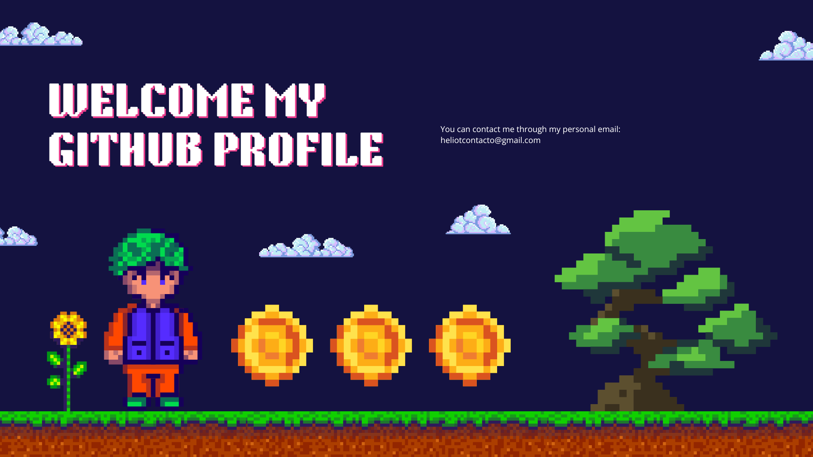

<h1 align="center">Hi, I'm Heliot 👋</h1>

## About me

- 💻 I’m a final year Computer Science undergraduate student at University of Las Palmas de Gran Canaria (ULPGC) 💻 
- ⌨️ Focused in Web Development
- 📈 I am experienced in frameworks such as Laravel or Angular with a big interest in React.
 

## **Main** projects
<table>
<tr>
<td width="50%">
<h3 align="center">Facial recognition</h3>

Discover the functionality of <strong>facial recognition</strong> with a fully functional application developed in <strong>Python</strong> and utilizing a <strong>genetic algorithm</strong>. This project was created in collaboration with <a href="https://github.com/AlejandroDavidArzolaSaavedra" target="_blank">Alejandro David Arzola Saavedra</a>.

                                                                                      
</td>

<td width="50%">
                
<h3 align="center">SwapForFood</h3>

                                       

 

A mobile application designed to help decide on a nearby restaurant through a game, developed in Kotlin with the collaboration of <a href="https://github.com/DerKom" target="_blank">Marcos Vázquez Tascón</a>. The application includes communication with a server built in Python and implemented using websockets.

                                                             
</table>                                                                                 

 

<table>
<tr>
<td width="50%">
<h3 align="center">HairSalon Website</h3>

A webpage I contributed to. It's a hair salon platform where users can explore the most popular haircuts and book an appointment. This webpage was built using Angular and is connected to Firebase, a non-relational database.

                                                                                      
</td>       

<td width="50%">
<h3 align="center">Money Calculator</h3>

An application developed in Java that allows users to convert amounts of money from one currency to another. It is connected to a REST API that provides real-time exchange rates.

                                                                                      
</td>  
</table>                                                                                 

 

### ⚙️ &nbsp;GitHub Analytics

### 🏆 GitHub Profile Trophy

  

